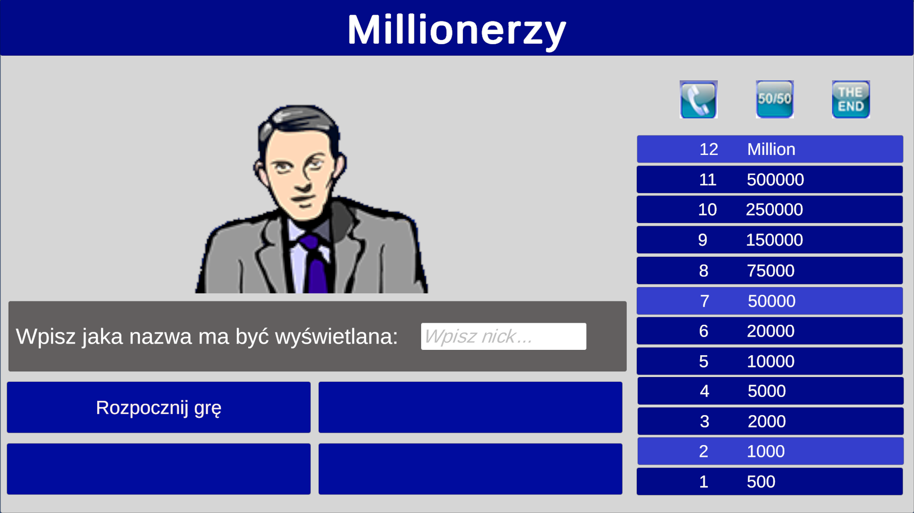
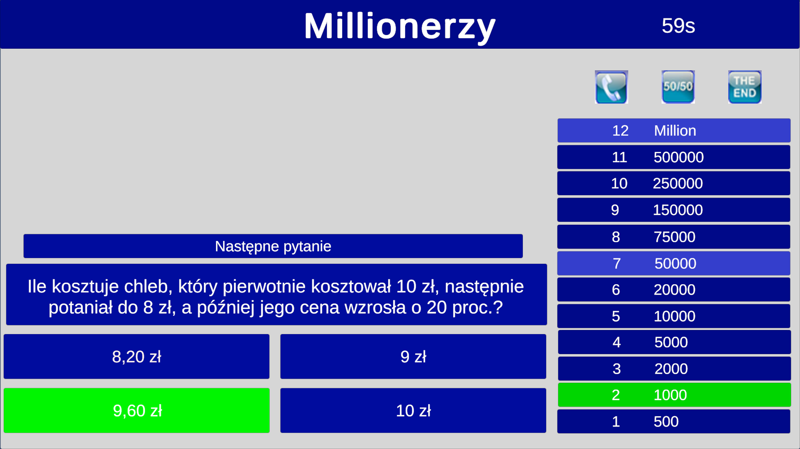
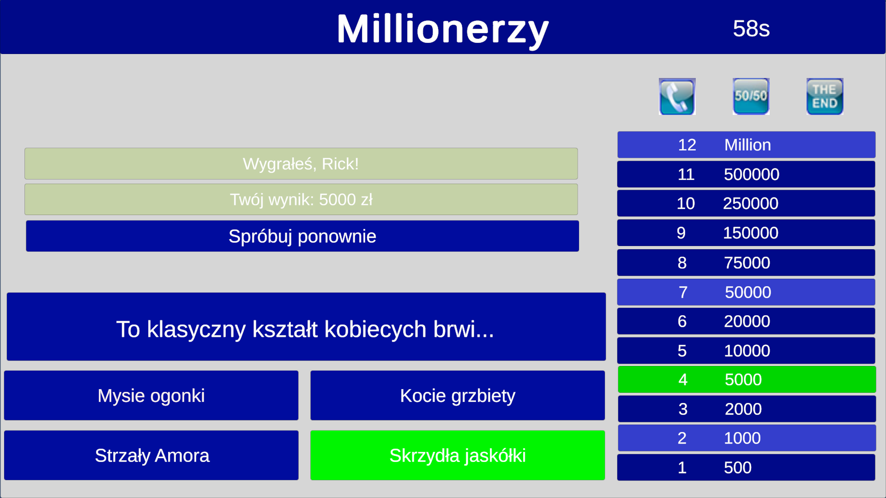

# Simple Millionaires Game

A simple millionaires game made with Unity and C#. The game language is Polish.

## Features
- Setting nickname
- 12 randomized questions with rising difficulty (number of possible questions decreases with each question)
- 2 lifelines:
  - 50/50 (removes 2 wrong answers)
  - Phone a friend (shows right answer)
- Limited time to answer (60 seconds)

